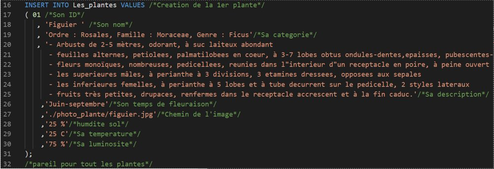

# Projet Plante Plus  

## Arborescence  

Vous trouverez dans ce répertoire Git :  

- Dans [Gestion](./"Gestion de projet"), il vous sera fournis le GANNT, le MCD et les membres du groupe.   

- Dans SQL se trouve le code source de la base de données SQL ainsi qu'un dossier d'images.  

- Dans Java, le code source que nous avons réalisé mais qui n'est pas utilisé pour le moment.  

- Dans Sources Arduino, vous y retrouverez le code nécessaire de votre matèriel Arduino.  

- Le plus important, vous trouverez le code python pour déployé Arduino et son application.  

- Et pour finir, fichier texte où plusieurs données y sont stockés.

## Indications relatives au déploiement  

Tous d'abord, il vous faudra vous munir au préalable d'**une plante** que vous voulez calibrer et tester.  
Ensuite, raccordez _le testeur d'humidité_, _le testeur de température_ et _le testeur de luminosité_ à la plante. Par précaution, vous pourrez vérifier le cablâge de l'outils avec l'image ci-dessous.

Et pour finir, une fois la plante raccordée à l'outils **Arduino**, branchez l'outils via le câble USB fournis et lancer le logiciel **Python** `arduino.py`.  

## Rapport  

Pour commencer, nous avons créés le **MCD** pour pouvoir visualiser et commencer la base de données. Nous avons, ensemble, montés le dossier technique pour être certain d'avoir cerné le but du projet et ce qu'il était demandé du _4 Mars au 20 Mars_.  

Ensuite, nous nous sommes concentrés sur **la base de données**. Nous avons d'abord pensés à utiliser **MySQL Server**, puis nous nous sommes penchés sur **MariaDB** pour son utilisation plus facile et instinctive ce qui nous aussi permis de mettre le chemin des images au lieu des images elle-même. Ensuite lors des recherches effectuées des plantes et de leurs caractéristiques, certaines plantes n'avaient pas assez de documentations ce qui nous a néccessité de plus ample recherche. La plupart des données collecté proviennent du site `"tela-botanica.org"`. La réalisation de la base de données s'est poursuivis du _18 Mars jusqu'au 24 Avril_.  

  
  
  
   
A première vue, nous avons pensé à l'utilisation d'un **Broker/MQTT**, mais son utilisation complexe n'était pas adpaté, nous avons donc décidé de partir sur un module **Arduino** où l'extraction, l'utilisation et la manipulation des données nous étaient plus simple à élaborer.  

  
   
La troisième partie s'est focalisée sur **le développement logiciel**, nous avons commencé à créer l'application avec **Java** où nous avons eu divers problèmes dues à l'utilisation nouvelle de ce langage. Les problèmes que nous avons rencontrés lors de la conception du logiciel en **Java** sont ; la lecture et la manipulation, non pas de la base de données mais de l'outils utilisé. Ainsi nous avons optés pour le langage **Python** qui offre plus de possibilités et est plus facile en termes d'utilisations. Par rapport aux images, **Python** nous permet de les traduire et, ainsi, de les afficher. Cependant, l'optimisation de **Tkinter** dans **Python** est restée relativement complexe. L'ensemble nous a pris du _22 Mars jusqu'au début Mai_.  

  
   
Pour finir, nous avons finalisés nos codes durant le mois de Mai, vérifié chaque détails afin d'être prêt pour le **jour J**.  

